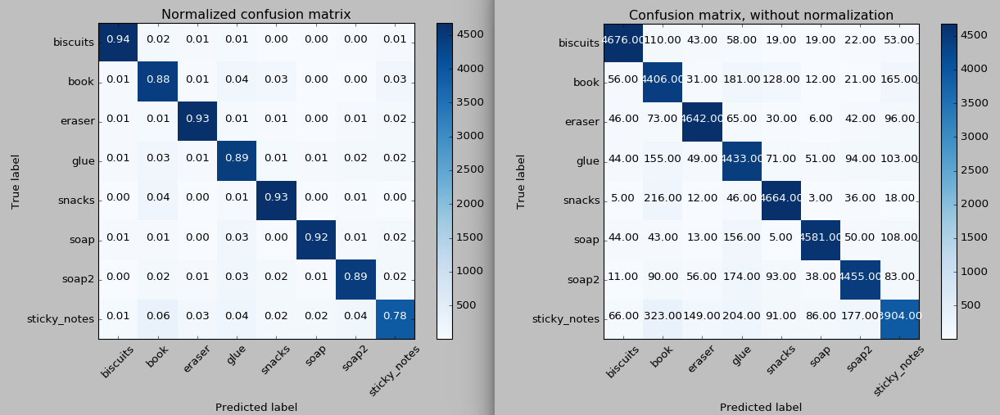
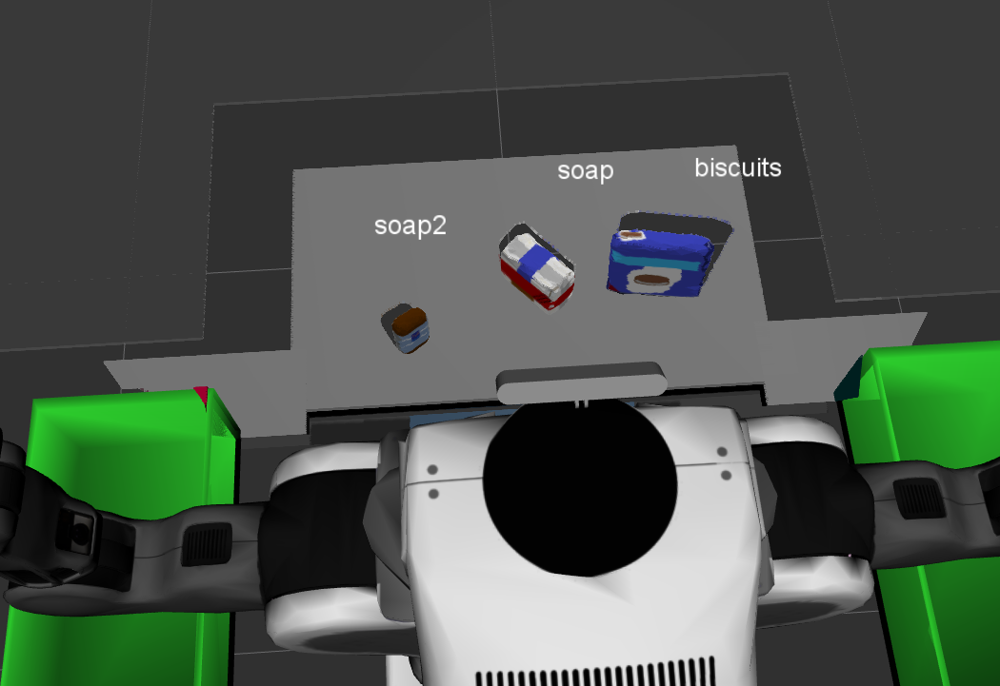
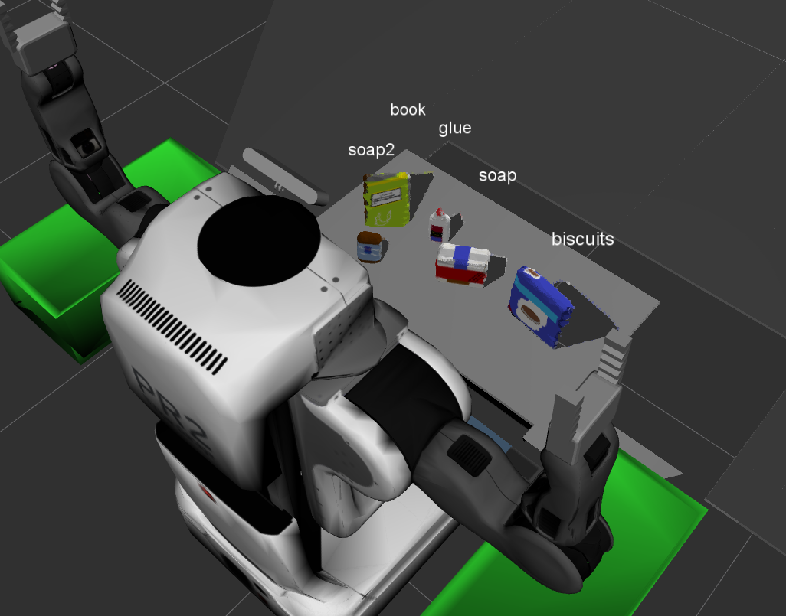
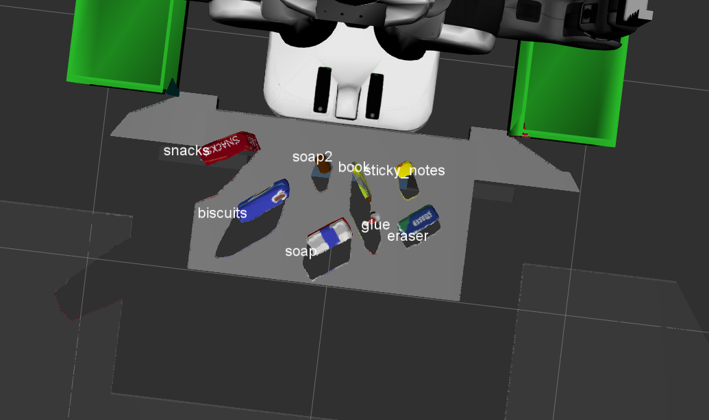

## Project: Perception Pick & Place

---

# Required Steps for a Passing Submission:
1. Extract features and train an SVM model on new objects (see `pick_list_*.yaml` in `/pr2_robot/config/` for the list of models you'll be trying to identify).
2. Write a ROS node and subscribe to `/pr2/world/points` topic. This topic contains noisy point cloud data that you must work with.
3. Use filtering and RANSAC plane fitting to isolate the objects of interest from the rest of the scene.
4. Apply Euclidean clustering to create separate clusters for individual items.
5. Perform object recognition on these objects and assign them labels (markers in RViz).
6. Calculate the centroid (average in x, y and z) of the set of points belonging to that each object.
7. Create ROS messages containing the details of each object (name, pick_pose, etc.) and write these messages out to `.yaml` files, one for each of the 3 scenarios (`test1-3.world` in `/pr2_robot/worlds/`).  See the example `output.yaml` for details on what the output should look like.  
8. Submit a link to your GitHub repo for the project or the Python code for your perception pipeline and your output `.yaml` files (3 `.yaml` files, one for each test world).  You must have correctly identified 100% of objects from `pick_list_1.yaml` for `test1.world`, 80% of items from `pick_list_2.yaml` for `test2.world` and 75% of items from `pick_list_3.yaml` in `test3.world`.
9. Congratulations!  Your Done!

# Extra Challenges: Complete the Pick & Place
7. To create a collision map, publish a point cloud to the `/pr2/3d_map/points` topic and make sure you change the `point_cloud_topic` to `/pr2/3d_map/points` in `sensors.yaml` in the `/pr2_robot/config/` directory. This topic is read by Moveit!, which uses this point cloud input to generate a collision map, allowing the robot to plan its trajectory.  Keep in mind that later when you go to pick up an object, you must first remove it from this point cloud so it is removed from the collision map!
8. Rotate the robot to generate collision map of table sides. This can be accomplished by publishing joint angle value(in radians) to `/pr2/world_joint_controller/command`
9. Rotate the robot back to its original state.
10. Create a ROS Client for the “pick_place_routine” rosservice.  In the required steps above, you already created the messages you need to use this service. Checkout the [PickPlace.srv](https://github.com/udacity/RoboND-Perception-Project/tree/master/pr2_robot/srv) file to find out what arguments you must pass to this service.
11. If everything was done correctly, when you pass the appropriate messages to the `pick_place_routine` service, the selected arm will perform pick and place operation and display trajectory in the RViz window
12. Place all the objects from your pick list in their respective dropoff box and you have completed the challenge!
13. Looking for a bigger challenge?  Load up the `challenge.world` scenario and see if you can get your perception pipeline working there!

## [Rubric](https://review.udacity.com/#!/rubrics/1067/view) Points
### Here I will consider the rubric points individually and describe how I addressed each point in my implementation.  

---
### Writeup / README

### Exercise 1, 2 and 3 pipeline implemented
#### 1. Complete Exercise 1 steps. Pipeline for filtering and RANSAC plane fitting implemented.

This was very straightforward as it was explained very well in the lessons. I implemented all the filters that were explained in the lessons. I added an additional passthrough filter to remove the boxes from the point cloud so that only the table surface and the objects are in the point cloud.

I did not have to change any parameters from doing the individual lessons to the project.

The filter that were applied were downsampling, passthrough (twice, once to remove the bottom of the table and once to remove the edges of the red and green boxes), RANSAC segmentation and an outlier filter to remove noise.

#### 2. Complete Exercise 2 steps: Pipeline including clustering for segmentation implemented.  

Again, very straightforward. I only had to tweak the parameters for clustering the objects. The clustering appeared very stable to me, even though there was some residual noise that I could not remove with the outlier filter.

#### 2. Complete Exercise 3 Steps.  Features extracted and SVM trained.  Object recognition implemented.

Extracting the features was very slow on my PC with the original settings. I then decided to also use a voxel filter to downsample the captured point clouds before capturing the features. After all this is also how it will be implemented in the recognition node. With this the speed was a lot better and I decided to capture each object 5000 times and bin the colors and normals into 32 bins.

I switched the kernel of the SVM to "linear", but otherwise kept all other parameters on "auto" or undefined. With a smaller batch of captured objects I tried sklearn's `GridsearchCV` class to further optimize the SVM, but this gave only very slight improvement at best, so I decided to keep things simple.

The rbf-kernel gave a better performance on the training/testing dataset, but performed less well on the actual scene. This is why then changed it to linear kernel.

Applying the trained SVM to the project was again very straightforward. I was able to accurately detect all the objects in the scene. In some instances, it got one object wrong or neglected one, but a second later that was fine again.

This is the first scene:

The second scene (soap2 and book labels not perfectly aligned though...):

And the third scene:

### Pick and Place Setup

#### 1. For all three tabletop setups (`test*.world`), perform object recognition, then read in respective pick list (`pick_list_*.yaml`). Next construct the messages that would comprise a valid `PickPlace` request output them to `.yaml` format.

At first I loaded all the required parameters and initialized the variables. For the `test_scene_num` I modified the launch file such that it stores the scene number in the ROS parameter server. This way I did not have to do that manually, but could read the number with `rospy.get_param()`. Also this made changing the scene easier, as I only had to change one parameter in the launch file.
Next I stored dropbox coordinates.

And finally I could loop through the pick list. I was not entirely certain, what exactly the output file should include, but I decided to loop through the pick list and then construct the `PickPlace` request for all the objects in the scene that are also on the pick list. For the `pick_pose`, I calculated the centroid of the object as position and left the orientation piece undefined, i.e. all values zero.

With the helper functions, I could then save everything in `.yaml`-files. The output files can be found in the `pr2_robot/scripts/`-folder.

# Possibilities for improvement:
I think that I could still improve on accuracy of the object recognition. The accuracy on the training/test set was below 90% with the linear kernel. I am not entirely sure why that was. People on Slack reported that they had more that 90% accuracy with a much smaller batch of captured features. A possibility might be to play more with the number of bins and the hyperparameters of the SVM. With the large number of features I decided not to do that.

Also I am not entirely satisfied with the noise reduction of the point cloud. This could also be improved, though I tried quite a lot of parameters.
